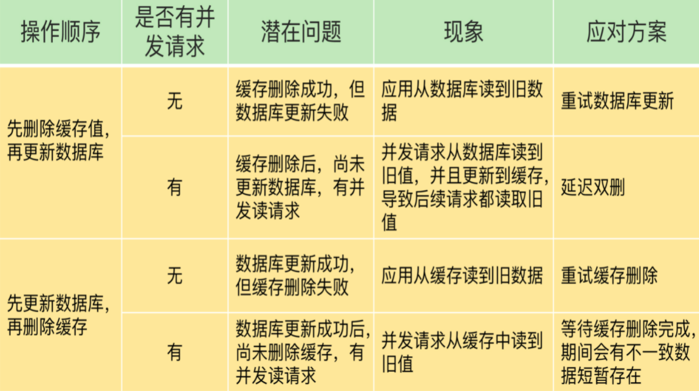

## MySQL 基础

### 存储引擎

#### 存储引擎相关的命令

`show engines;`

### MyISAM 和 InnoDB 的区别

- MyISAM只有表锁，InnoDB有表锁和行锁，默认行锁
- MyISAM不支持事务，InnoDB有提交和回滚事务的能力（默认级别可重复读）
- InnoDB支持数据库崩溃后的安全恢复
- InnoDB支持MVCC（行锁升级版）

## 锁机制与 InnoDB 锁算法

- InnoDB默认行锁
- InnoDB三种行锁算法
  - Record Lock：记录锁，锁单行记录
  - Gap Lock：间隙锁，锁定范围，不含记录自身
  - Next-key Lock：Record Lock + Gap Lock，临键锁，包含记录自身

## 事务

### 何为事务？

一组操作，要么全部执行成功，要么全部执行失败

### 何为数据库事务？

区别于分布式事务

### 开启一个事务

```sql
START TRANSACTION
...
COMMIT;
```

### 何为 ACID 特性呢？

A为原子性，即一组操作不可分割

C为一致性，事务执行前后，数据保持一致

I为隔离性，各个事务间不会相互影响

D为持久性，一个事务提交后，对数据的修改是持久的

### 并发事务带来哪些问题?

先开启事务A，再开启事务B

- 脏读：A可读B未提交的修改
- 不可重复读：A可读B提交的修改（重复读数据可能变）
- 幻读：A第一次读的时候有，第二次读没有

### 事务隔离级别有哪些?

读取未提交：A可读B未提交的修改

读取提交：A可读B提交的修改

可重复读：A读取不到B提交的修改

串行化：B等待A事务提交

### MySQL 的默认隔离级别是什么?

可重复读

------------------------------------------------------

## Redis

### 简单介绍一下 Redis 呗!

内存数据库

### 缓存数据的处理流程是怎样的？

请求，读数据--缓存--有就返回，无就数据库

### 为什么要用 Redis/为什么要用缓存？

因为快，从内存读数据比从磁盘加载数据块

### Redis 除了做缓存，还能做什么？

消息队列，分布式锁

### Redis 常见数据结构以及使用场景分析

### string

#### 应用场景

计数：访问次数、点赞等

##### 普通字符串的基本操作

`set k v`  |  `get k`   |    `exists k`    |    `strlen k`    |    `del k`

##### 批量设置

`mset k1 v1 k2 v2`    |    `mget k1 k2`

##### 计数器

- 字符串内容为数字，即value为数字

`set number 1`    |    `incr number`    |    `get number`    |    `decr number` 

##### 过期普通字符串的基本操作

`expire k 60`    |    `setex k 60 v`    |    `ttl k`

### list

#### 应用场景

消息队列、慢查询

##### 通过 `rpush/lpop` 实现队列

`rpush myList a`    |    `rpush myList b c`    |    `lpop myList` 

##### 通过 `rpush/rpop` 实现栈

`rpush myList a b c d`    |    `rpop myList`

##### **通过 `lrange` 查看对应下标范围的列表元素**

`lrange myList 0 1`    |    `lrange myList 0 -1`

##### 通过 `llen` 查看链表长度

`llen myList`

### hash

#### 应用场景

对象数据的存储

##### 新增

`hmset userinfoKey name "tom" gerden "male" age "24"`

##### 查看 key 对应的 value中指定的字段是否存在

`hexists userinfoKey name`

##### 获取存储在哈希表中指定字段的值

`hget userinfoKey name`

##### 获取在哈希表中指定 key 的所有字段和值

`hgetall userinfoKey`

##### 获取 key 列表

`hkeys userinfoKey`

##### 获取 value 列表

`hvals userinfoKey`

##### 修改某个字段对应的值

`hset userinfoKey name "alex"`

### set

#### 应用场景

求交集、并集，如共同关注

##### 添加元素进去

`sadd mySet v1 v2`

##### 不允许有重复元素

`sadd mySet v1`会失败

##### 查看 set 中所有的元素

`smembers mySet`

##### 查看 set 的长度

`scard mySet`

##### 检查某个元素是否存在set 中，只能接收单个元素

`sismember mySet v1`

##### 获取 mySet 和 mySet2 的交集并存放在 mySet3 中

`sinterstore mySet3 mySet mySet2`

##### 并集

`sunion mySet1 mySet2`返回交集

##### 差集

`sdiff mySet1 mySet2`返回m1-(m1交m2)

### sorted set

#### 应用场景

实时排行信息

##### 添加元素到 sorted set 中 3.0 为权重

`zadd myZset 3.0 value1`

##### 一次添加多个元素

`zadd myZset 2.0 value2 1.0 value3`

##### 查看 sorted set 中的元素数量

`zcard myZset`

##### 查看某个 value 的权重

`zscore myZset value1`

##### 顺序输出某个范围区间的元素，0 -1 表示输出所有元素

`zrange myZset 0 -1`

##### 逆序输出某个范围区间的元素，0 为 start  1 为 stop

`zrevrange myZset 0 -1`

### bitmap

#### 应用场景

保存状态信息并对这些信息进行分析的场景

`setbit online 10561 1`    |    `get online 10561`    |    `bitcount online`

### Redis 单线程模型详解

网络IO和数据读写是单线程，通过多路复用机制避免了网络IO阻塞（accent、send和recv）

#### Redis 没有使用多线程？为什么不使用多线程？

多线程就有同步和资源保护问题，多线程不易调试和维护

#### Redis6.0 之后为何引入了多线程？

多线程处理网络IO，提供网络IO读写性能

#### Redis 给缓存数据设置过期时间有啥用？

全部存内存，会oom

#### Redis 是如何判断数据是否过期的呢？

过期字典

#### 过期的数据的删除策略了解么？

惰性删除，取出key的时候才检查过期时间，对cpu友好

定期删除，对内存友好

#### Redis 内存淘汰机制了解么？

- volatile-lru：从**已设置过期时间**的数据集中**选最近最少使用**的，适用置顶需求
- volatile-lfu：从**已设置过期时间**的数据集中**选最不常用**的
- volatile-ttl：从**已设置过期时间**的数据集中**选即将过期**的
- volatile-random：从**已设置过期时间**的数据集中**随机挑选**
- allkeys-lru：从**所有数据集**中**选最近最少使用**的，优先选用
- allkeys-random：从**所有数据集**中**随机挑选**
- allkeys-lfu：从**所有数据集**中**选最不常用**的

#### Redis 持久化机制(怎么保证 Redis 挂掉之后再重启数据可以进行恢复)

- AOF：写后日志，在命令执行后才记录，不会阻塞当前写操作
  - 写回策略
    - Always：同步写回，命令执行完就写回
    - Everysec：每秒写回
    - No：操作系统控制写回
  - 重写机制：子进程拷贝内存，记入重写日志，若发生写操作，记进AOF和重写日志
- RDB：内存快照，bgsave子进程，写时复制，全量快照之后增量快照
- Redis 4.0：混合使用AOF和RDB（默认关闭），内存快照以一定频率执行，两次快照间用AOF

#### Redis bigkey

##### 什么是 bigkey？

string的value超过10kb，复合类型的value包含元素超过5000

##### bigkey 有什么危害？

消耗内存

##### 如何发现 bigkey？

通过`redis-cli --bigkeys`查找，或者分析RDB文件

#### Redis 事务

`multi`开启事务，`exec`执行事务，`discard`取消事务，`watch`监听key，若key被修改，事务失败

redis事务没有回滚，事务的作用是把一组操作打包执行

#### Redis 可以做消息队列么？

redis 5.0 增加 stream 数据结构，可做消息队列，支持

- 发布/订阅模式
- 按照消费者组进行消费
- 消息持久化（AOF和RDB）

#### 缓存穿透

##### 什么是缓存穿透？

缓存中不存在的key，直接穿透缓存，落在数据库上

##### 缓存穿透情况的处理流程是怎样的？

用户请求---缓存命中---直接返回

​                 |___ 缓存无----数据库

##### 有哪些解决办法？

- 缓存空值或者缺省值
- 布隆过滤器：使用N个哈希函数计算得到N个哈希值，把N个哈希值对bit数组长度取模，得到每个哈希在数组中的位置，对应位置bit位设为1，查询时直接计算哈希，看bit数组位置是否为1
- 前端进行请求检测

### 缓存击穿

频繁访问的热点数据过期，请求落在数据库

- 热点数据不设过期

### 缓存雪崩

- 缓存中大量数据同时过期，请求落在数据库上
  - 设置过期时间时，增加随机数
  - 服务降级：核心数据问数据库，非核心直接返回预定值或空值或错误信息
- Redis实例宕机
  - 服务熔断或请求限流
  - 事前预防：通过主从构建集群

### 如何保证缓存和数据库数据的一致性？



### 缓存读写策略

#### cache aside pattern 旁路缓存

适合读请求较多的场景，服务端维系cache和db，db为准

**写**：先更新db，然后删除缓存

**读**：cache中读到直接返回，未读到问db，然后返回，再把数据放进cache

缺陷

- 首次请求，数据一定不在cache中，可提前将热点数据放进cache
- 写操作频繁会影响缓存命中，更新db时更新cache，加锁/分布式锁（数据一致）或者加比较短的过期时间（数据不一致）

#### read/write through pattern 读写穿透

**写**：先查cache，cache中不存在，直接更新db，cache中存在，先更新cache，然后cache服务更新db

**读**：cache中有则直接返回，没有则先从db读取，然后写到cache后返回数据

#### write behind pattern 异步缓存写入

cache服务负责cache和db读写，异步缓存写入只更新缓存，不直接更新db，采用异步批量的方式更新db
